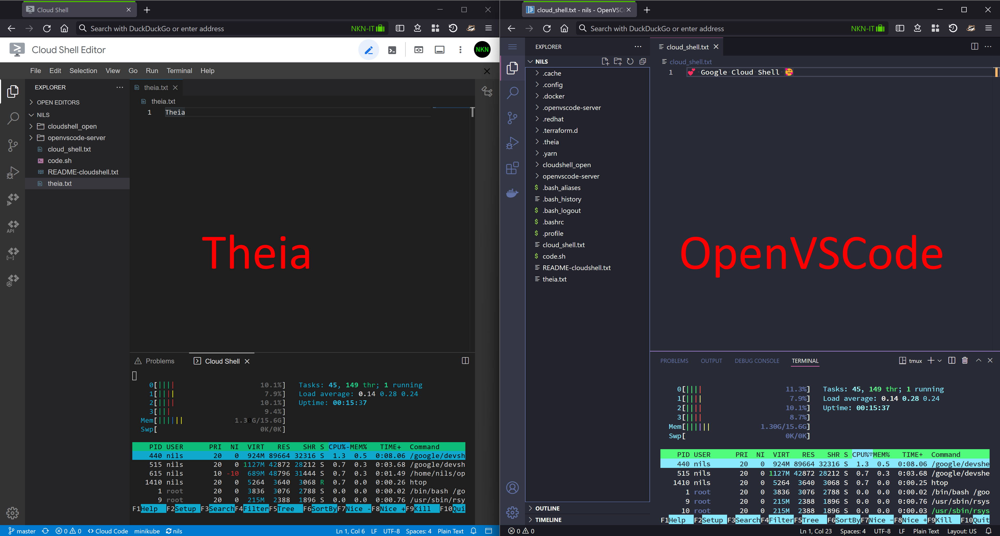

# Run OpenVSCode Server in Google Cloud Shell

Install and start [OpenVSCode Server](https://github.com/gitpod-io/openvscode-server) in [Google Cloud Shell](https://cloud.google.com/shell/).

Google Cloud Shell is available at no additional cost (free) for Google Cloud customers and you get 5 GB of persistent storage.

## 1. Open

Start Google Cloud Shell:

[](https://shell.cloud.google.com/?show=terminal)

## 2. Download

Download `code.sh` script:
```bash
curl -O "https://raw.githubusercontent.com/Cyclenerd/google-cloud-shell-vscode/master/code.sh"
```

## 3. Install

Install latest OpenVSCode Server:
```bash
bash code.sh install
```

## 4. Start

Start OpenVSCode Server:
```bash
bash code.sh
```

Open web preview URL:


Edit settings (<kbd>Ctrl</kbd> + <kbd>,</kbd>):
```json
{
    "telemetry.enableTelemetry": false,
    "editor.minimap.enabled": false,
    "editor.renderWhitespace": "all",
    "editor.renderControlCharacters": true,
    "editor.fontSize": 14,
    "editor.fontFamily": "'Source Code Pro Medium', 'Source Code Pro', Monaco, 'Courier New', monospace",
    "workbench.colorTheme": "Dracula",
    "editor.acceptSuggestionOnEnter": "smart",
    "workbench.startupEditor": "newUntitledFile",
    "files.eol": "\n",
    "git.enableSmartCommit": true,
    "terminal.integrated.defaultProfile.linux": "tmux",
    "extensions.ignoreRecommendations": true,
    "git.ignoreMissingGitWarning": true,
    "workbench.editor.enablePreview": false,
    "problems.decorations.enabled": false,
    "html.autoClosingTags": false,
    "diffEditor.ignoreTrimWhitespace": false
}
```

## Tip

Add `code.sh` to your Bash aliases with absolute pathnames. You can then execute `code` anywhere.

Alias (~/.bash_aliases):
```text
echo "alias code='bash `pwd`/code.sh'" >> ~/.bash_aliases && bash
```

## Usage

Help:
```bash
bash code.sh help
```

```text
Usage: code.sh [COMMAND]
COMMAND is one of the following:
        install - install latest OpenVSCode Server
        upgrade - alias for install
        start   - start OpenVSCode Server (127.0.0.1:8080)
        remove  - remove OpenVSCode Server
        help    - displays help (this message)
```

## Why

Why..? You may ask..: "For me, the standard looks exactly the same, doesn't it?"



The default editor is [Theia](https://theia-ide.org/), and it's definitely an excellent product.

[GitPod](https://www.gitpod.io/blog/cloud-ide-history) writes about this topic in their blog:

> To convince developers to say goodbye to local development, it is important to not reinvent the wheel but offer an editing experience that:
>
> * Is backed by a thriving community
> * Wins hearts and minds of developers
> * Works on modern web technology
>
> This is VS Code.

My developer heart is set on VS Code 🧑‍💻💘.
I don't want to miss the marketplace and the VS Code extensions.
I also like the 160px more vertical space for the source code.

If you feel the same way, this project with the script will help you.
If you get along with Theia, also good.
This is diversity.

If you rely on [Cloud Code](https://marketplace.visualstudio.com/items?itemName=GoogleCloudTools.cloudcode), please support this [issue](https://github.com/GoogleCloudPlatform/cloud-code-vscode/issues/256).
Google unfortunately does not publish to the vendor neutral, Open Source marketplace for VS Code [Open VSX](https://open-vsx.org/).

## Contributing

Have a patch that will benefit this project?
Awesome! Follow these steps to have it accepted.

1. Please read [how to contribute](CONTRIBUTING.md).
1. Fork this Git repository and make your changes.
1. Create a Pull Request.
1. Incorporate review feedback to your changes.
1. Accepted!

## License

All files in this repository are under the [Apache License, Version 2.0](LICENSE) unless noted otherwise.
